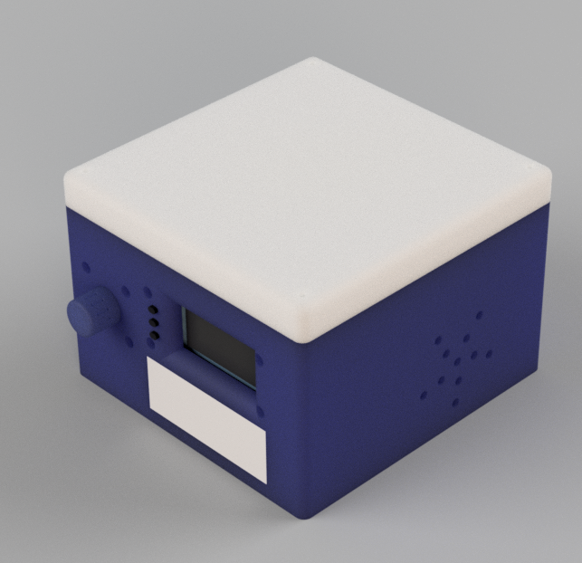

# Solar Lamp/Alarm Clock
This is a project to build solar/sunrise alarm clock, which uses a lamp to mimic the shade and intensity of the rising sun to more gradually and calmly rouse you from your slumber when compared to the blaring of a traditional alarm clock.

On the hardware side of things, I'm using a number of products from the Adafruit Feather and Stemma families, including a Feather M0 Wifi as the core microcontroller, some featherwings for 7-segment and OLED displays and playing audio (sometimes you want a traditional alarm clock too), as well as some NeoPixels for the lamp itself. For a full rundown, see the [parts list](#parts-list).

For the body, I 3D modeled a case to be 3D printed to house all of the components. Visible on the front is the knob for the rotary encoder, as well as the OLED screen (black rectangle), 7-segment display (for time), three black buttons, and screwholes for mounting the electronics to the case. One  the side are some holes for one of the speakers: 

On the software side of things, I'm using PlatformIO to manage my libaries and toolchain, which has worked wonderfully. The Feather M0 is Arduino framework compatible, and most of the libraries provided by Adafruit for talking to the Feather/Stemma peripherals are written with Arduino in mind, so that's the framework that I ended up using (for better or for worse). Since the peripherals all already have libraries, most of the work I've done is to implement the glue connecting them, and create a UI. So far I've written a nice little tree style menuing system that you navigate using the rotary encoder, with submenus and the ability to edit values/toggle things on/off. For example, it's being used below to set the color of each channel of the RGBW LEDs when the system is acting as a static lamp.


## Todo
I still have to actually implement the timekeeping functionality, as well as making the occasional Network Time Protocol request (that's what the Wifi is for) to keep the clock synced up. From there I also want to display local temperature and humitidy, both as measured by the sensor onboard, and as obtained via local weather forcast over the Internet. Beyond that, there are lots of other possibilities, including things like using the Feather M0 to serve up a webpage interface to adjust all the settings, using the speakers for actual music playback, etc.
## Parts List
Besides the standard fare of a soldering iron, solder, wire and wire strippers/cutters necessary for assembly, this project also uses:

* [Adafruit Feather M0 Wifi](https://www.adafruit.com/product/3010)
* [Adafruit 128x64 OLED FeatherWing](https://www.adafruit.com/product/4650)
* [Adafriut 4-digit Seven segment Featherwing](https://www.adafruit.com/product/3110)
* [Adafruit Music Maker Featherwing w/ Amp](https://www.adafruit.com/product/3436)
* [Adafruit Featherwing Doubler Protoboard](https://www.adafruit.com/product/2890)
* [Adafruit Stemma Qt Mini GPS](https://www.adafruit.com/product/4415)
* [Adafruit Adafruit AHT20 Temperature & Humidity Sensor Breakout Board](https://www.adafruit.com/product/4566)
* [Adafruit NeoPixel Jewel RGBW (Warm)](https://www.adafruit.com/product/2858)
* [Adafruit 12 NeoPixel Ring RGBW (Warm)](https://www.adafruit.com/product/2851)
* [Adafruit I2C Stemma QT Rotary Encoder Board](https://www.adafruit.com/product/4991)
* [2.1mm jack to screw terminal block](https://www.adafruit.com/product/368)
* [5V DC power supply](https://www.adafruit.com/product/276)
* [USB Micro B Male Plug to 5-pin Terminal Block](https://www.adafruit.com/product/3972)
* [TI 74AHCT125](https://www.adafruit.com/product/1787)
* [STEMMA QT / Qwiic 50mm Cable](https://www.adafruit.com/product/4399) x2
* [STEMMA QT / Qwiic 100mm Cable](https://www.adafruit.com/product/4210)
* [40mm 4 Ohm Speaker](https://www.adafruit.com/product/3968) x2
* [Rotary Encoder](https://www.digikey.ca/en/products/detail/bourns-inc/PEC11L-4115F-S0020/4699168)
* [Feather Female Stacking Headers](https://www.digikey.ca/en/products/detail/adafruit-industries-llc/2830/5823439) x2
* [Feather Female Headers](https://www.digikey.ca/en/products/detail/adafruit-industries-llc/2886/5823440) x2
* [470 Ohm Resistor](https://www.digikey.ca/en/products/detail/te-connectivity-passive-product/ROX3SJ470R/3477442)
* [1000uF Electrolytic Capacitor](https://www.digikey.ca/en/products/detail/panasonic-electronic-components/EEU-FR0J102/9921020)
* Micro-usb cable
* SD card

## Secrets
The file `src/secrets.h` is used to define the Wifi SSID and password, and is excluded from this repo for obvious reasons. To compile this project, you'll need to make your own, like:
```
#define WLAN_SSID       "Network_SSID"
#define WLAN_PASS       "password"
```